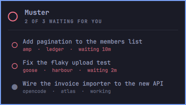

# Muster

The roll call of the coding agents running on this machine: which are working,
which are waiting for you, and how long they have been waiting.



*Three sessions, two of them waiting.*

## The problem it solves

Run three agents at once and you have three terminals, all called `Alacritty`.
You cannot tell, without clicking into each one, which is still thinking, which
finished ten minutes ago, and which is sitting there waiting for you to answer
a question.

So the agent waits. And the thing you were parallelising turns back into a
queue with you at the head of it, not knowing you are holding it up.

## Install

```bash
omarchy plugin add https://github.com/fernandomenolli/omarchy-muster.git --enable
```

Needs Omarchy 4, Hyprland, and `jq`.

## Remove

```bash
omarchy plugin remove io.github.fernandomenolli.muster
rm -rf ~/.local/state/omarchy/plugins/io.github.fernandomenolli.muster
```

That second line is one small file: the moment each waiting agent stopped, so
the answer survives the shell restarting. Nothing else is written anywhere.

## In the bar


*The hand, and the count when there is one.*

A hand up. An agent that stops is not reporting a status, it is asking you
something, and the gesture for that is the one everybody learned in a classroom
before they learned anything else on this machine. It is an outline while
everything is running and fills in when someone is waiting on you.

Weight rather than colour, deliberately. Red in this bar means something is the
matter, and an agent finishing its turn is not that: it is the ordinary end of
a piece of work.

The number beside it only appears when it has something to say, and then it
says one thing: how many agents are waiting on you. A count sitting at nought
all day is a dashboard, and a dashboard is a thing you learn to stop seeing.

## How it knows

An agent producing output writes to its terminal. One waiting for you writes
almost nothing. That is the whole signal, read from `wchar` in
`/proc/<pid>/io` and taken as a rate.

There are three states, not two, and the middle one is what makes this
delicate. Measured on a real desktop:

```
waiting for you          8 bytes a second     a cursor blinking at a prompt
busy and silent        100 bytes a second     a spinner and a clock, no output
producing output       700 bytes a second     and up, often far up
```

A session waiting on a background agent of its own sits in that middle band.
It is busy, and it is not asking you for anything, so it counts as working.
The line is drawn at 45 bytes a second, in the gap below it.

This is the part worth knowing before you trust it: the gap between waiting
and busy-but-silent is about twelvefold, not the three orders of magnitude the
extremes suggest. A rate rather than an amount per check, so that changing how
often it looks does not quietly change what it decides.

CPU time was tried first and is far worse: a terminal user interface redraws
whether or not anything is happening, so three sessions burned similar CPU
while two of them were doing nothing at all.

Nothing depends on the mark an agent draws in its title. Those are theirs, and
they change between versions.

## Using it

| Action | What happens |
|---|---|
| Left click | the roll call |
| Right click | jump to the one that is waiting |
| Click a row | jump to that session |

And on a keybinding, straight to whichever has been waiting longest:

```lua
-- ~/.config/hypr/bindings/muster.lua
o.bind("SUPER + A", "Next waiting agent",
  "omarchy-shell io.github.fernandomenolli.muster next")
```

## Any agent, not just one

It watches process names, and ships knowing `claude`, `codex`, `gemini`,
`aider`, `opencode`, `amp`, `goose` and `crush`. Add yours in the settings.
Anything that runs in a terminal and writes as it works belongs there.

Finding the window is done by walking up from the agent to whichever ancestor
owns one, so it does not matter how deeply your setup nests it: a shell, a
multiplexer, a wrapper script.

## What it does not do

**The clock is not reset by the shell.** How long an agent has been waiting
has nothing to do with how long the thing watching it has been up, so the
moments are kept in `~/.local/state/` and taken back when the shell starts.
A session is recognised by its process and its window together, so a pid that
comes round again under a different window does not inherit a stranger's clock.

**It cannot tell "finished" from "asking you a question".** Both look
identical from outside: the process stopped writing. What it reports is how
long it has been quiet, which is the part that makes you go and look.

**The agent has to do its own writing.** The signal is what the agent process
itself sends to the terminal, so a wrapper that hands the output to a child
process to print leaves the agent looking permanently quiet. Every agent that
ships as a terminal program writes its own output, which is why the list of
known ones works, but it is worth knowing before adding something unusual.

**It is not a usage meter.** There are eight of those in the catalogue already.
This one is about work, not spend.

## Settings

Open the panel and they are switches. Tapping one takes effect straight away
and is remembered in `~/.local/state/omarchy/plugins/io.github.fernandomenolli.muster/preferences.json`.

Omarchy has no settings screen, and the shell hands a plugin a copy of its
settings precisely so that changing them in place cannot leak back to disk. So
the panel keeps its own file rather than writing yours. If you would rather set
them in `~/.config/omarchy/shell.json`, a key on this widget's entry still
works and is what the switches start from:

```json
{
  "id": "io.github.fernandomenolli.muster",
  "showWhenIdle": false
}
```

Delete the preferences file and the panel goes back to whatever shell.json
says.

**The threshold is not one of the switches, on purpose.** Nobody can tell what
forty-five bytes a second means by looking at it, and the two ways of getting
it wrong both look like the plugin working: set it low and nothing is ever
reported as waiting, set it high and everything is. It is a calibration, not a
preference, and it stays in the file where changing it means having read what
the three bands are.

| Setting | Default | What it does |
|---|---|---|
| Check every | 3000 ms | |
| Bytes a second that count as working | 45 | sits in the gap between a blinking cursor and a spinning one |
| Keep the icon with no agents | off | otherwise it only appears when there is something to say |
| Process names to watch | eight known agents | space separated |

## What it costs

Measured on the machine this was built on, an AMD box with 24 cores running
Omarchy 4.0.0.alpha and Hyprland 0.56.2, with three agents running. The method
is to read `utime + stime` from `/proc/<pid>/stat` for the shell process, with
the plugin enabled and then disabled, and take the difference.

| | Shell alone | With this plugin |
|---|---|---|
| One minute, three agents running | 115 ms of CPU | 165 ms |
| Memory | ~500 MB | no measurable change |

Fifty milliseconds a minute, which is eight hundredths of one percent of one
core.

**It does not get heavier as it runs.** The work in a cycle is one file read
per agent, so it is set by how many agents you have and not by how long the
session has been open. The expensive half, finding the agents at all, runs
twice a minute and when a window opens or closes, rather than on every check.

## The scan

Finding the agents means walking every process on the machine, matching the
ones you asked for, climbing each match's ancestors until one of them owns a
window, and resolving that process's directory. That is `bin/muster-scan`, and
reading it is the way to know exactly what this plugin looks at.

A compiled version of the same scan ships under `backend/` for the
architectures there is a build for, and the script hands over to it when it
finds one. Neither depends on the other: with no binary present the script does
the work itself, and it is also the readable definition of what the binary
does.

```
bash + awk + jq + hyprctl    15.7 ms
rust + hyprctl                8.3 ms
hyprctl alone, paid by both   3.0 ms
```

Twice a minute, so the difference is fourteen milliseconds a minute. It is
there because it costs nothing to keep, not because the plugin needed it.

## Tests

```bash
node tests/run.js
```

They cover `model/`: reading a scan, deciding working from waiting, keeping
the moment one stopped, and noticing the transition worth interrupting you for.

## Licence

MIT.
